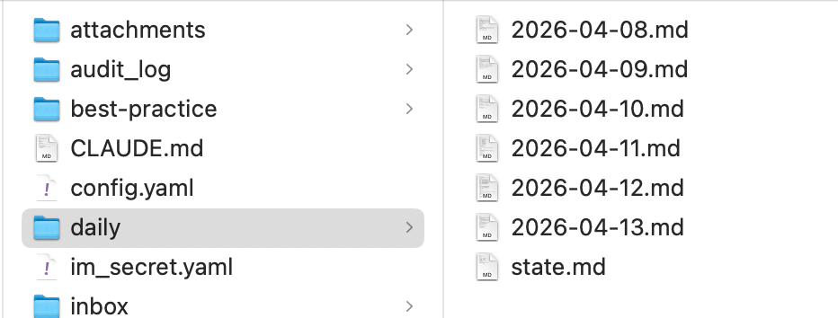
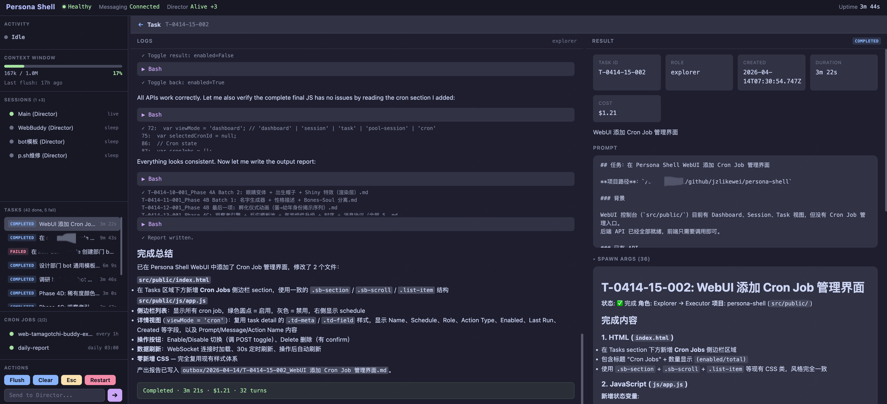

# Persona Shell

> 把你最顺手的 agent 当虾养。

把现成的 agent 接入 IM、赋予持久记忆和人格、7×24 替你在线。Persona Shell 不造 agent，只做这层壳。

不知道怎么用？clone 下来，让你的 agent 来读。

> **⚠️ 早期项目**：仅在 macOS (Apple Silicon) 上开发和日常使用。Linux 理论可用但未验证，Windows 不支持（依赖 named pipe / mkfifo）。

> **⚠️ 安全提示**：Persona Shell 以 `--dangerously-skip-permissions` 模式运行 Claude Code，即 AI 可以无需确认地执行 shell 命令、读写文件。仅在你信任的机器上运行，不要暴露到公网。详见 [安装指南](docs/setup.md)。

## TL;DR

外挂IM让CC干活、并行干，后台干、定时干、用不同身份干。


干完了写md。


有个简单的管理页面。


## 设计理念

- **保持简单** — agent 的推理、工具调用、代码能力由 Claude Code / Codex 提供，Persona Shell 只做编排和消息转发
- **持久记忆** — Just md files. 身份、人格、日报、工作记忆，全部是 Markdown，git 管理
- **长期运行** — daemon 模式 + 自动上下文刷新（FLUSH），不怕 context window 耗尽
- **多实例** — 主分身 + 群聊 Director Pool，并行任务、后台任务、定时任务
- **多后端** — 同一套编排支持 Claude Code 和 Codex，按角色或按群独立切换

## 支持的 Agent 后端

| Agent | 状态 |
|-------|------|
| [Claude Code](https://docs.anthropic.com/en/docs/claude-code) | ✅ 主力后端 |
| [Codex](https://github.com/openai/codex) | ✅ 后台任务 + 群聊 Director |

完整功能矩阵和详细用法见 [使用指南](docs/usage.md)。

## 快速开始

```bash
git clone https://github.com/jzlikewei/persona-shell.git
cd persona-shell

# 一键初始化（安装依赖 + 创建身份仓库 + 配置飞书凭据）
bun run init

# 自定义你的分身（可选，推荐）
cd ~/.persona && claude /soul-crafting

# 启动
bun run dev
```

需要先创建飞书应用，详见 [安装指南](docs/setup.md)。

## 架构概览

```
IM 消息 → TS Shell → MessageQueue → SessionBridge (主 Director)
              │                         │
              │                    ┌────┴────┐
              │                    │ Adapter  │ ← Claude / Codex 协议适配
              │                    │ Runtime  │ ← 进程生命周期
              │                    └─────────┘
              │
              │  群聊 → DirectorPool ─→ SessionBridge (群1, 群2, ...)
              │
              └── Web Console (localhost:3000)
```

Director 通过三层架构支持多后端：**SessionBridge**（会话编排）→ **Adapter**（协议适配）→ **Runtime**（进程管理）。技术细节见 [架构文档](docs/architecture.md)。

## 目录结构

```
persona-shell/
├── src/
│   ├── index.ts                   # 入口，消息路由 + 命令分发
│   ├── session-bridge.ts          # 会话桥（FLUSH / 队列 / bootstrap）
│   ├── director-session-adapter/  # Claude / Codex 协议适配
│   ├── director-runtime/          # Claude / Codex 进程管理
│   ├── director-pool.ts           # 多 Director 实例管理
│   ├── console.ts                 # Web 控制台 + API
│   ├── queue.ts                   # 消息队列（持久化 + cancel）
│   ├── config.ts                  # 配置加载（YAML → typed config）
│   ├── persona-process.ts         # 统一进程 spawn（Claude / Codex）
│   ├── claude-process.ts          # Claude FIFO 管道进程管理
│   ├── log-parser.ts              # 日志解析（Web 控制台用）
│   ├── logger.ts                  # 日志分级
│   ├── messaging/                 # 通讯层
│   │   ├── messaging.ts             # 接口定义
│   │   ├── messaging-router.ts      # 消息路由
│   │   └── feishu.ts                # 飞书 WebSocket 实现
│   ├── task/                      # 任务系统
│   │   ├── task-store.ts            # SQLite 存储（Task + CronJob + State KV）
│   │   ├── task-runner.ts           # 后台任务执行
│   │   ├── task-mcp-server.ts       # MCP 工具服务器
│   │   └── scheduler.ts            # Cron 调度
│   └── __tests__/                 # 单元测试（263 tests, 75% 行覆盖率）
├── docs/
├── logs/
└── scripts/
```

## 文档

| 文档 | 内容 |
|------|------|
| [安装与配置](docs/setup.md) | 飞书应用创建、配置文件、服务化、身份仓库 |
| [使用指南](docs/usage.md) | 命令、群聊策略、任务、Cron、Web 控制台、人格自定义 |
| [技术架构](docs/architecture.md) | 三层架构、通讯层、消息路由、FLUSH、进程容灾 |
| [Agent 后端](docs/agent-backends.md) | Claude Code / Codex 启动机制、协议、参数、会话恢复 |
| [运维速查](docs/ops-reference.md) | 命令、日志路径、运行时文件 |

## License

[MIT](LICENSE)
