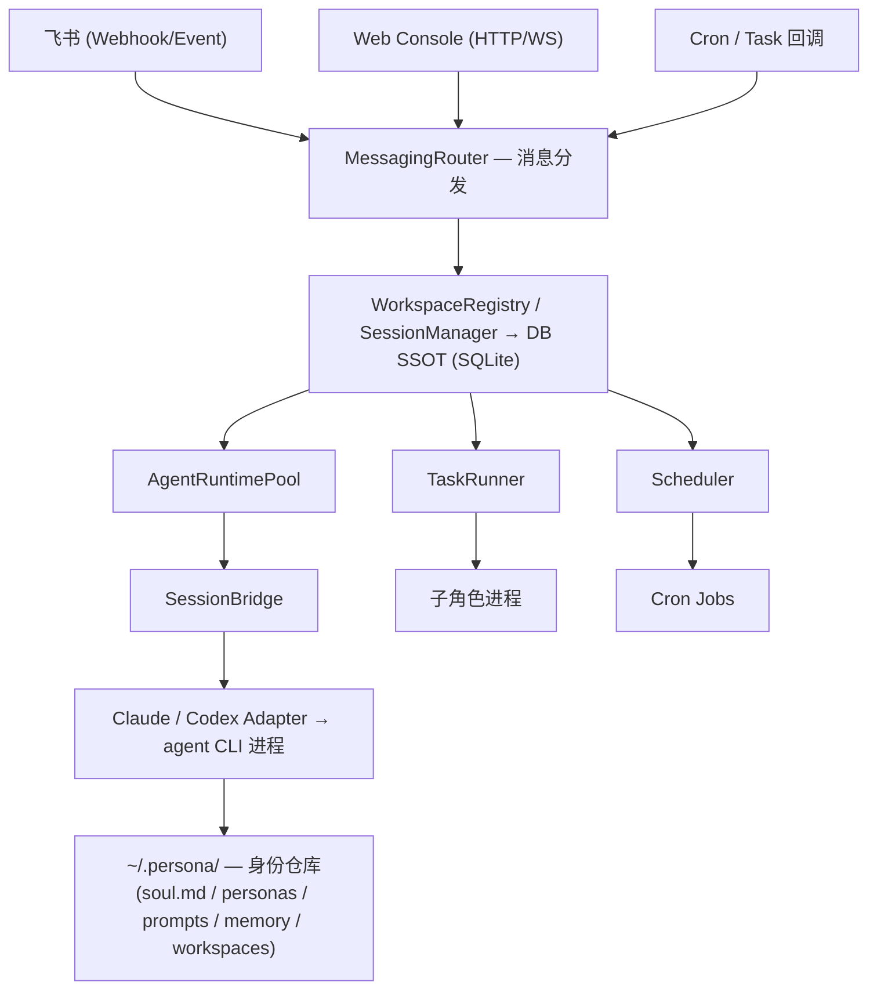

# Persona Shell

[](https://github.com/jzlikewei/persona-shell/actions/workflows/test.yml)

> Give your AI agent a home, a memory, and a working life.

Persona Shell 是一个给个人 AI 分身使用的运行外壳。Claude Code、Codex 负责推理、写代码和操作系统；Persona Shell 负责把它们接进你的真实工作生活：接消息、维护身份、记住现场、派发后台任务、接住回调、把不同项目放进不同 workspace。

## 为什么值得存在

强 agent 越来越多，但日常工作中你会不断遇到这些问题：

- **切换成本高**：不同任务要切 agent、切模型、切 prompt，每次都是手动重新配置。
- **个人知识无处安放**：传统项目维护的是团队共有知识和配置，但个人的工作进度、偏好、上下文没有归宿。
- **产出不可追溯**：agent 做了什么、产出了什么、中间经历了什么，关掉终端就消失了。

一次对话可以解决一个问题；一个人的工作系统要跨天、跨项目、跨群聊。Persona Shell 的价值是把 agent 从”一次性工具”变成”长期在线的个人分身”。

它解决的是 agent 外围的真实工作问题：

- **身份可维护**：`soul.md`、`personas/`、`prompts/` 定义它是谁、以什么方式行动。
- **上下文有归宿**：每个 workspace 有自己的 `context.md`，项目状态可以持续生长。
- **任务可派发**：Director 接住用户意图，把调研、修复、写作、审查派给子角色。
- **结果可追溯**：后台产物进入 `outbox/`，日志、transcript、task record 都能回看。
- **后端可替换**：同一套人格和记忆可以跑在 Claude Code、Codex App Server 等 agent 后端上。
- **数据在本地**：prompt、记忆、产物、配置都在你自己的文件系统里，由 git 管理。

## 能做什么

- **IM 分身**：通过飞书和你的 AI 分身对话，群聊和私聊都会映射到明确的 workspace。
- **Web 工作台**：在浏览器里查看 Chat、Tasks、Files，切换 workspace/session，观察 streaming、tool call 和任务结果。
- **多 Workspace / 多 Session**：每个项目或群聊都有独立上下文；一个 workspace 可以同时保留多个 session。
- **后台任务**：把调研、修复、写作、审查等工作派给子角色，结果进入 outbox 并回调当前会话。
- **定时任务**：用 Cron 持续触发角色任务、Director 消息或 shell action。
- **多 Agent 后端**：同一套人格与记忆可运行在 Claude Code、Codex App Server 等后端上。
- **持久记忆**：`~/.persona/workspaces/*/context.md` 保存工作状态，`outbox/` 保存后台产物，原生 transcript 用于历史恢复。

## 定位

不重新造轮子，只找最好的轮子装在你的车上。强 agent 已经存在，Persona Shell 把精力放在 agent 外围的部分：身份、上下文、路由、任务生命周期、交付物、长期可维护的记忆结构。

> **Note**: Persona Shell 通过 CLI 调用 agent 后端，兼容 Codex 订阅套餐。Claude 订阅不兼容，因为 Anthropic 不允许以 SDK/CLI 方式使用订阅额度。

> **Warning**: macOS (Apple Silicon) 是主要开发和日常使用环境。Linux 可自行尝试；Windows 当前无支持计划。

> **Warning**: Persona Shell 会用高权限模式运行本地 agent，例如 Claude Code 的 `--dangerously-skip-permissions`、Codex 的 `danger-full-access`。适合放在你信任的个人机器上运行。远程访问时请开启 token、反向代理认证和隧道保护。详见 [安装指南](docs/setup.md) 与 [远程访问](docs/remote-access.md)。

## 快速开始

```bash
git clone https://github.com/jzlikewei/persona-shell.git
cd persona-shell

# 安装依赖、创建身份仓库、生成基础配置
bun run init

# 自定义你的分身
cd ~/.persona && claude /soul-crafting

# 启动
cd ~/github/jzlikewei/persona-shell
bun run dev
```

飞书应用、凭据、服务化运行见 [安装与配置](docs/setup.md)。

## 核心概念

### 身份仓库 `~/.persona/`

你的 prompt 资产和长期记忆放在这里：

```text
~/.persona/
├── soul.md              # 人格定义：你的 AI 分身是谁
├── personas/            # 角色：不同任务场景的行为模式
├── prompts/             # 系统行为模板
├── memory/              # 长期记忆
├── workspaces/          # 工作空间上下文
├── outbox/              # 后台任务产出
├── daily/               # 日报与工作记录
└── config.yaml          # 运行配置
```

### Workspace

Workspace 是持续工作的边界。一个飞书群、一个项目目录、一个长期主题，都可以成为 workspace。每个 workspace 有自己的 `context.md`，保存目标、决策、待办和当前状态。

### Session

Session 是一次 agent 运行会话。一个 workspace 可以有多个 session；默认 session 写入 DB，消息路由以 sessionId 为准。这样群聊、Web、Cron、后台任务回调都能回到具体会话。

### Agent 后端

| Agent | 状态 | 典型用途 |
|-------|------|----------|
| Claude Code | 默认后端 | 通用编码、系统操作、长期 Director |
| Codex App Server | 可用 | 长文写作、审查、后台任务、低延迟 session |

后端配置在 `~/.persona/config.yaml` 的 `agents.providers` 与 `agents.roles` 中。详见 [Agent 后端文档](docs/agent-backends.md)。

## 常用命令

| 命令 | 作用 |
|------|------|
| `/status` | 查看当前会话状态 |
| `/flush` | 保存上下文并刷新 session |
| `/clear` | 丢弃当前上下文并创建新 session |
| `/new-session` | 轻量切换到新 session |
| `/switch-agent <agent>` | 切换当前会话后端 |
| `/shell-restart` | 重启整个 Shell 进程 |
| `/help` | 查看可用命令 |

完整命令和运维信息见 [使用指南](docs/usage.md) 与 [运维速查](docs/ops-reference.md)。

## 架构概览


```mermaid
flowchart TD
    A1["飞书 (Webhook/Event)"] --> MR
    A2["Web Console (HTTP/WS)"] --> MR
    A3["Cron / Task 回调"] --> MR
    MR["MessagingRouter — 消息分发"] --> WS
    WS["WorkspaceRegistry / SessionManager → DB SSOT (SQLite)"] --> ARP
    WS --> TR
    WS --> SCH
    ARP["AgentRuntimePool"] --> SB["SessionBridge"]
    TR["TaskRunner"] --> SUB["子角色进程"]
    SCH["Scheduler"] --> CRON["Cron Jobs"]
    SB --> ADAPTER["Claude / Codex Adapter → agent CLI 进程"]
    ADAPTER --> PERSONA["~/.persona/ — 身份仓库\n(soul.md / personas / prompts / memory / workspaces)"]
```

关键边界：

- `MessagingRouter`：飞书、Web、内部回调的统一入口分发。
- `SessionManager`：workspace/session 业务路由。
- `AgentRuntimePool`：runtime 生命周期、队列、恢复、streaming。
- `SessionBridge`：单 session 的消息收发、flush、restart、指标和事件。
- `TaskRunner / Scheduler`：后台任务派发与 Cron 调度。
- `task-store`：workspace、session、task、cron 的 SQLite SSOT。
- `task-mcp-server`：对外暴露任务能力的 MCP 接口，供 agent 内部调用。
- `web-v2`：面向人的工作台（React + Vite），通过 Console API / WebSocket 通信。

技术细节见 [架构文档](docs/architecture.md)。

## 开发与验证

```bash
# 类型检查 + no-any guard
bun run check

# 单元测试
bun run test

# Web 构建
bun run --cwd web-v2 build

# Web smoke
bun run smoke:web
```

`bun run test` 会显式扫描 `src/__tests__` 和 `web-v2/__tests__`，避免本地 `dist/__tests__` 重复执行。

## 文档

| 文档 | 内容 |
|------|------|
| [安装与配置](docs/setup.md) | 飞书应用、配置文件、服务化、身份仓库 |
| [使用指南](docs/usage.md) | 命令、群聊策略、任务、Cron、Web 控制台、人格自定义 |
| [技术架构](docs/architecture.md) | 三层架构、路由、runtime、FLUSH、容灾 |
| [运维速查](docs/ops-reference.md) | 命令、日志路径、运行时文件 |
| [微信接入方案](docs/weixin-openclaw-integration.md) | 复用 Tencent openclaw-weixin 接入 p-shell 的设计与实施计划 |
| [Agent 后端](docs/agent-backends.md) | Claude / Codex 后端配置与能力边界 |
| [远程访问](docs/remote-access.md) | HTTPS、Nginx、SSH 隧道、token 认证 |

## License

[MIT](LICENSE)
