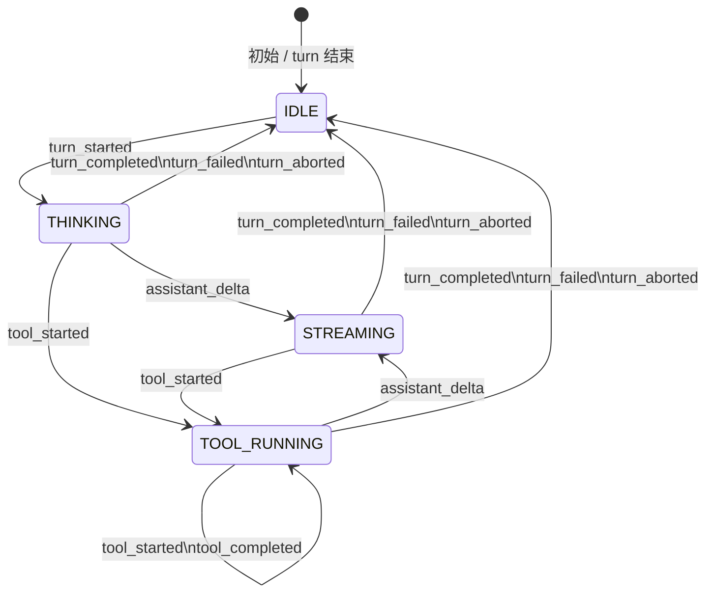
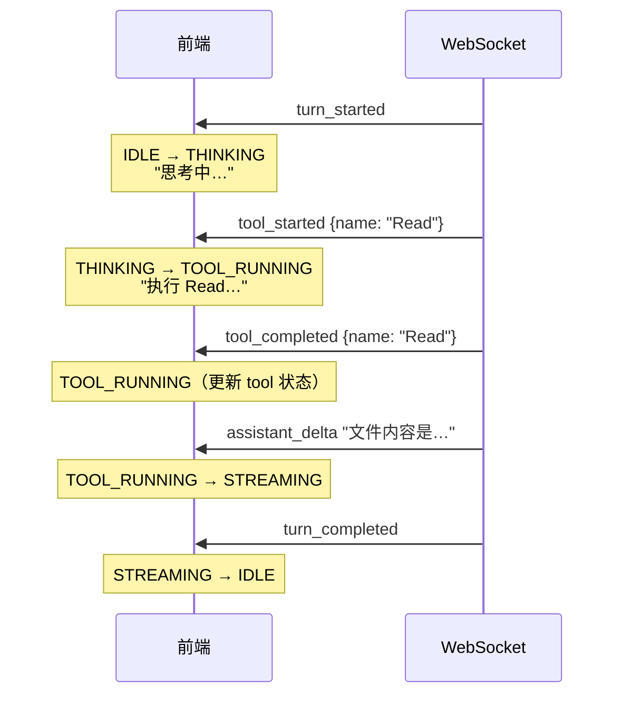
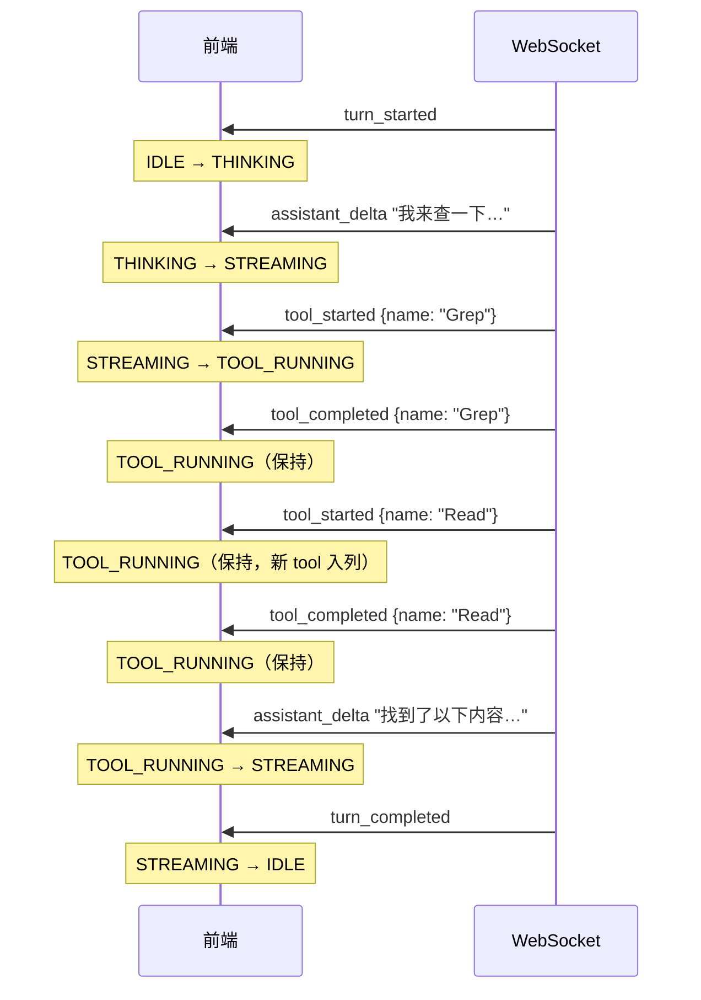
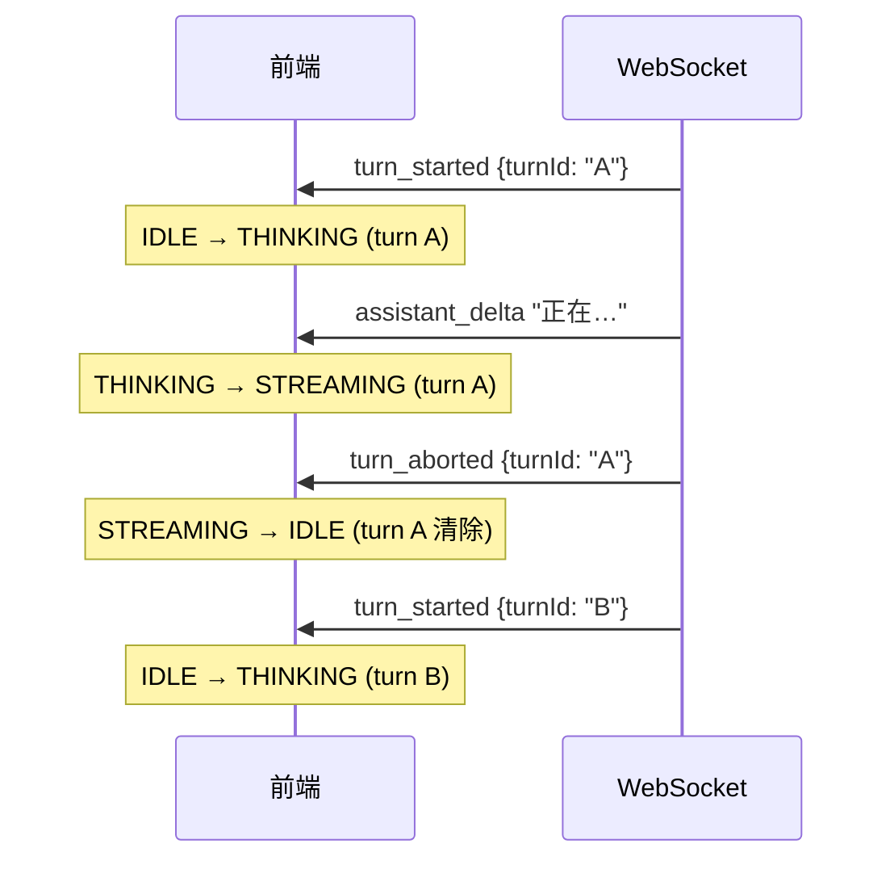
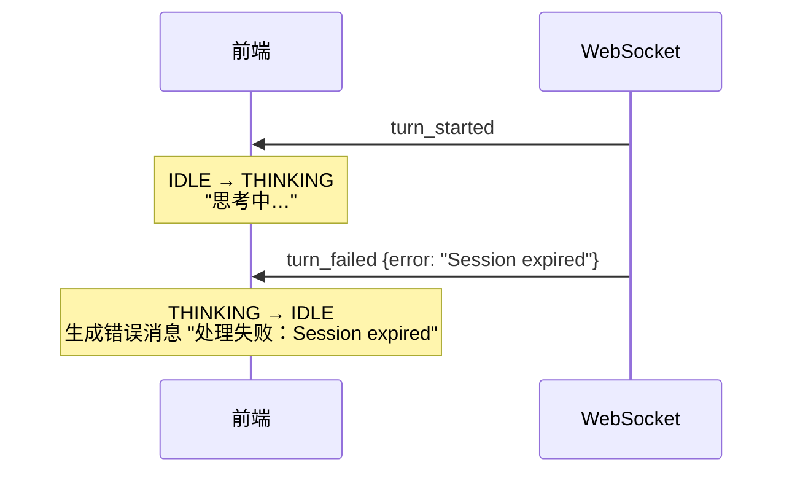
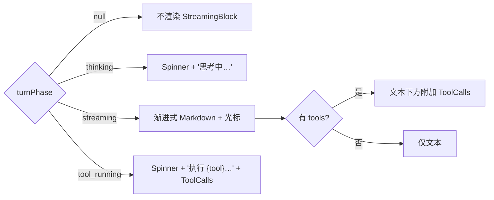

# 流式 Turn Event 设计

> 描述从 adapter 产出流式事件 → SessionBridge 统一转换 → WebSocket 广播 → Web 前端渲染的完整链路。

## 概览

系统通过 `AssistantTurnEvent` 统一模型，将不同 adapter 的流式输出归一化为前端可消费的事件流。事件沿以下管道流动：

```
Adapter (claude / codex-app-server)
  │  onChunk / onToolCall / onTurnComplete
  ▼
SessionBridge
  │  emitTurnEvent() → emit('turn-event', AssistantTurnEvent)
  ▼
DirectorPool (多实例时)
  │  re-emit('turn-event')
  ▼
Console (WebSocket server)
  │  broadcastWs({ type: 'turn_event', event })
  ▼
Web-v2 (use-chat.ts)
  │  on('turn_event') → React state
  ▼
StreamingBlock (chat.tsx)
```

## Adapter Hook 接口

所有 adapter 实现相同的 hook 回调（`DirectorSessionAdapterHooks`）：

| Hook | 说明 | Claude | Codex App-Server |
|------|------|--------|------------------|
| `onChunk(text)` | 文本增量 delta | 每个 `text_delta` 立即调用 | 每个 `agentMessage/delta` 立即调用 |
| `onToolCall(name?, tool?)` | 工具开始或完成 | `content_block_start` 时触发 | delta / item.completed 时触发 |
| `onMetrics(update)` | token 用量、cost | `result` 事件中提取 | `tokenUsage/updated` 通知 |
| `onTurnComplete(result)` | 轮次结束 | `result` 事件 | `turn/completed` 通知 |
| `onTurnFailure(message)` | 轮次失败 | session 过期等 | 进程异常 |
| `onRuntimeClosed()` | 进程关闭 | pipe close | stdio close |

**适配器支持范围**：当前统一模型仅覆盖 Claude 和 Codex App-Server。二者流式行为一致（逐 token delta + 工具事件），可共用同一套前端逻辑。Kimi 为整块交付（无增量 delta），暂不纳入统一流式模型。

## AssistantTurnEvent 类型

定义在 `src/director-session-adapter/index.ts`：

```typescript
interface AssistantTurnEvent {
  type: 'turn_started' | 'assistant_delta'
      | 'tool_started' | 'tool_completed'
      | 'turn_completed' | 'turn_failed' | 'turn_aborted'
  director: string         // bridge label
  sessionId?: string | null
  turnId: string           // 每轮唯一 ID
  messageId?: string       // 关联的用户消息 ID
  timestamp: string        // ISO 时间戳
  text?: string            // assistant_delta 的文本增量
  content?: string         // turn_completed 的完整回复
  tool?: DirectorToolCall  // 工具信息
  durationMs?: number | null
  error?: string           // turn_failed 的错误信息
}
```

## SessionBridge 转换逻辑

### 轮次入队 (enqueuePendingTurn)

用户消息入队时立即发射 `turn_started`：

```
bridge.send(content)
  → enqueuePendingTurn({ type: 'user', correlationId })
    → emitTurnEvent(turn, { type: 'turn_started' })
```

### 可见性过滤 (isVisibleTurn)

只有 `user` 和 `system-reply` 类型的 turn 会产生前端可见事件。以下类型被过滤：

- `bootstrap` — 启动引导
- `flush-checkpoint` / `flush-bootstrap` — FLUSH 流程
- `system-absorbed` — 被吸收的系统消息
- `system-forward` — cron 转发

### 流式抑制条件

以下状态下，`onChunk` / `onToolCall` 产生的事件不会被转发：

| 状态 | 触发场景 | 影响 |
|------|---------|------|
| `flushing = true` | FLUSH 进行中 | 所有 delta/tool 事件被丢弃 |
| `bootstrapping = true` | bootstrap 进行中 | 同上 |
| `discardNextResponse = true` | FLUSH 后的迟到响应 | 同上 |

### 事件转换映射

| Adapter Hook | SessionBridge 行为 | 产出事件 |
|-------------|-------------------|---------|
| `onChunk(text)` | `handleStreamChunk()` | `assistant_delta` |
| `onToolCall(name, tool)` | `handleToolCall()` | `tool_started` 或 `tool_completed` |
| `onTurnComplete(result)` | `handleTurnComplete()` | `turn_completed` |
| `onTurnFailure(message)` | `handleTurnFailure()` | `turn_failed` |
| (bridge 主动 abort) | steer / interrupt | `turn_aborted` |

### 工具状态判定

`handleToolCall()` 根据 `DirectorToolCall.status` 字段判定事件类型：

- `status === 'running'` 或无 result → `tool_started`
- `status === 'completed'` / `'failed'` 或有 result → `tool_completed`

## Turn 生命周期

### 事件序列

一个 turn 的事件流是线性的，但工具调用与文本流可交替出现：

```
turn_started
  → assistant_delta * N        # 文本流（0 或多次）
  → tool_started               # 工具开始（0 或多次）
  → tool_completed             # 工具完成
  → assistant_delta * N        # 工具后继续文本流
  → tool_started / ...         # 可能再次进入工具
  → turn_completed             # 正常结束
    | turn_failed              # 异常结束
    | turn_aborted             # 被中断
```

### 前端 TurnPhase 状态机

> ✅ **已实现** — 自 2026-06-04 起，`web-v2/src/hooks/use-chat.ts` 实现了完整的状态机。`activity` 状态保留用于向后兼容，但不再驱动 `StreamingBlock` 可见性。



### 状态定义

| 状态 | TurnPhase 值 | 含义 | UI 表现 |
|------|-------------|------|---------|
| **IDLE** | `null` | 无活跃 turn | StreamingBlock 不渲染 |
| **THINKING** | `'thinking'` | turn 已开始，等待首个 delta 或 tool | 展示 spinner + "思考中…" |
| **STREAMING** | `'streaming'` | 正在接收文本增量 | 渐进式 markdown + 光标闪烁 |
| **TOOL_RUNNING** | `'tool_running'` | 正在执行工具调用 | 展示 spinner + "执行 {toolName}…" + 工具卡片 |

### 状态转换表

| 当前状态 | 事件 | Guard 条件 | 下一状态 | 前端 Side-effect |
|---------|------|-----------|---------|-----------------|
| IDLE | `turn_started` | — | THINKING | 重置 `streaming='', tools=[], turnId=event.turnId` |
| IDLE | `turn_started` (新 turnId ≠ 旧 turnId) | 旧 turn 未结束 | THINKING | 先清除旧 turn 状态，再重置为新 turn |
| THINKING | `assistant_delta` | — | STREAMING | `streaming += event.text` |
| THINKING | `tool_started` | — | TOOL_RUNNING | 合并 tool 到 `streamingTools` |
| THINKING | `turn_completed` | — | IDLE | 生成 ChatMessage，清除流式状态 |
| THINKING | `turn_failed` | — | IDLE | 生成错误 ChatMessage，清除流式状态 |
| THINKING | `turn_aborted` | — | IDLE | 清除流式状态，不生成消息 |
| STREAMING | `assistant_delta` | — | STREAMING | `streaming += event.text` |
| STREAMING | `tool_started` | — | TOOL_RUNNING | 合并 tool 到 `streamingTools` |
| STREAMING | `turn_completed` | — | IDLE | 生成 ChatMessage（用 event.content 或 streaming 文本） |
| STREAMING | `turn_failed` | — | IDLE | 生成错误 ChatMessage |
| STREAMING | `turn_aborted` | — | IDLE | 清除流式状态 |
| TOOL_RUNNING | `assistant_delta` | — | STREAMING | `streaming += event.text` |
| TOOL_RUNNING | `tool_started` | — | TOOL_RUNNING | 合并新 tool 到 `streamingTools` |
| TOOL_RUNNING | `tool_completed` | — | TOOL_RUNNING | 更新 tool status，保持当前状态等待下一步 |
| TOOL_RUNNING | `turn_completed` | — | IDLE | 生成 ChatMessage |
| TOOL_RUNNING | `turn_failed` | — | IDLE | 生成错误 ChatMessage |
| TOOL_RUNNING | `turn_aborted` | — | IDLE | 清除流式状态 |

### 边界场景

#### 1. THINKING 直接到 TOOL_RUNNING（无文本先行）

模型可能不输出任何文本就直接调用工具（如 Claude 调用 Read 读取文件）。此时不经过 STREAMING，从 THINKING 直接跳到 TOOL_RUNNING。



#### 2. 连续多轮工具调用

模型执行多个工具后再输出文本。TOOL_RUNNING 内部 tool_started/tool_completed 不改变 phase。



#### 3. 连续 turn_started（旧 turn 未结束）

用户快速发送多条消息，或 `turn/steer` 触发 abort + 新 turn。前端收到新 `turn_started` 时，如果 turnId 不同于当前活跃 turn，应先隐式清除旧 turn 状态。



#### 4. turn_failed 在 THINKING 阶段

模型尚未输出任何内容就失败（如 session 过期）。前端应展示错误消息。



#### 5. 空回复 turn

模型完成 turn 但没有输出任何文本（`streaming` 为空且 `event.content` 为空）。不生成 ChatMessage，静默回到 IDLE。

### 渲染规则总结



## WebSocket 广播

Console (`src/console.ts`) 监听 bridge/pool 的 `turn-event` 并广播：

```typescript
director.on('turn-event', (event) => {
  broadcastWs(JSON.stringify({ type: 'turn_event', event }))
})
```

同时保留旧的 `chunk` / `tool-call` / `chat_reply` 事件作为兼容通道。前端通过 `usingTurnEventsRef` 标记在收到首个 `turn_event` 后切换到新通道，忽略旧事件。

## 前端消费 (web-v2)

### use-chat.ts

核心状态：

| 状态 | 类型 | 说明 |
|------|------|------|
| `streaming` | `string` | 当前累积的流式文本 |
| `streamingTools` | `ChatToolCall[]` | 当前轮次的工具调用列表 |
| `activity` | `string \| null` | 当前活动状态标识 |

事件处理：

| 事件 | 处理 |
|------|------|
| `turn_started` | 重置 streaming/tools/activity，记录 turnId |
| `assistant_delta` | 累加文本到 streaming |
| `tool_started` / `tool_completed` | 合并到 streamingTools |
| `turn_completed` | 生成最终 ChatMessage，清除流式状态 |
| `turn_failed` | 生成错误 ChatMessage，清除流式状态 |
| `turn_aborted` | 清除流式状态 |

### StreamingBlock 渲染条件

当前可见性由三个信号驱动：

```tsx
{(streaming || activity || streamingTools.length > 0) && <StreamingBlock />}
```

### 已知问题

1. ~~**turn_started 到首个 delta 之间的空窗期**~~ ✅ **已修复**（2026-06-04）— 引入 `TurnPhase = 'thinking' | 'streaming' | 'tool_running' | null` 状态机后，`turn_started` 立即将 phase 设为 `'thinking'`，`StreamingBlock` 渲染 Spinner + "思考中…"，消除空窗期。

2. ~~**activity 语义混合**~~ ✅ **已修复**（2026-06-04）— `StreamingBlock` 可见性由 `turnPhase` 单独决定，工具名称从 `streamingTools` 数组中派生（取最后一个 `status === 'running'` 的 tool.name）。`activity` 状态保留以兼容旧通道，但不再承担可见性职责。

3. **工具状态歧义**：不同 adapter 的 `tool_started` 时序语义不完全一致。Claude 在工具开始执行时触发，Codex App-Server 在 delta 阶段就可能触发。

## 改进方向

> ✅ **已实施**（2026-06-04）。本节作为已落地改造的索引。

用 `TurnPhase` 状态机替代松散的 `activity` 信号，对齐上述状态建模：

```typescript
type TurnPhase = 'thinking' | 'streaming' | 'tool_running' | null
```

转换逻辑（对应状态转换表）：

| 事件 | 动作 |
|------|------|
| `turn_started` | `setTurnPhase('thinking')` — 立即展示"思考中" |
| 首个/后续 `assistant_delta` | `setTurnPhase('streaming')` — 切换到流式展示 |
| `tool_started` | `setTurnPhase('tool_running')` — 展示工具执行状态 |
| `tool_completed` | 保持 `'tool_running'`（等待下一步事件决定去向） |
| `turn_completed` / `turn_failed` / `turn_aborted` | `setTurnPhase(null)` — 清除 |

渲染条件简化为：

```tsx
{turnPhase && <StreamingBlock phase={turnPhase} text={streaming} tools={streamingTools} />}
```

工具名称从 `streamingTools` 数组中派生（取最后一个 `status === 'running'` 的 tool），不再由 `activity` 字符串承担。

### 超时安全阀（前端）

`use-chat.ts` 中实现了一个 120 秒的事件 watchdog：每次收到 turn 事件（`turn_started` / `assistant_delta` / `tool_started` / `tool_completed`）都重置一个 120 秒定时器；若定时器到期时 `turnPhase` 仍非 `null`，强制回退到 `null` 并清除流式状态。

设计动机：若 `turn_completed` / `turn_failed` / `turn_aborted` 事件因网络丢包或后端异常而丢失，前端会永远卡在 `thinking` / `streaming` / `tool_running` 状态。120 秒是保守阈值——正常 turn 不会持续这么久（流式输出 + 工具执行通常 < 60 秒），但留出余量应对长工具链。

实现位置：`turnPhaseTimeoutRef` + `armTurnPhaseTimeout()`，在 `clearLiveTurn()` 和 session reset 时调用 `clearTurnPhaseTimeout()` 取消定时器。

### P0 修复：handleRuntimeClosed 补发 turn_failed

`src/session-bridge.ts` 的 `handleRuntimeClosed` 在非 flush 状态下清空 `pendingTurns` 之前，对所有 `isVisibleTurn` 的 pending turn 发射 `turn_failed` 事件，错误信息为 `"Director 进程意外退出"`。

修复动机：此前 runtime 意外关闭时直接清空 `pendingTurns`，前端收不到终止事件，`StreamingBlock` 永远卡着。后端必须保证每个 `turn_started` 都有对应的终止事件，形成"成对"语义。

## 文件索引

| 文件 | 职责 |
|------|------|
| `src/director-session-adapter/index.ts` | `AssistantTurnEvent` 类型定义、adapter hook 接口 |
| `src/director-session-adapter/claude.ts` | Claude stream-json 解析 → hook 调用 |
| `src/director-runtime/codex-app-server.ts` | Codex JSON-RPC 解析 → hook 调用 |
| `src/session-bridge.ts` | hook → `emitTurnEvent()` 转换 |
| `src/director-pool.ts` | 多实例事件聚合 |
| `src/console.ts` | WebSocket 广播 |
| `web-v2/src/hooks/use-chat.ts` | 前端事件消费 + React 状态管理 |
| `web-v2/src/pages/chat.tsx` | StreamingBlock UI 渲染 |
